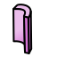

# FreeCAD Python GDML Workbench

FreeCAD's python Importer & Exporter for GDML files.

The experimental branches **compound** and **scan** have now been merged into master  

**Note:** Sister project development https://github.com/KeithSloan/FreeCAD_Geant4

## Prerequisites

* FreeCAD >= v0.18.3 (build that supports Python3)
* Python 3  
* python3-lxml package  
* git

> **Note:** As I had to make a lot of changes to get things working with Python3 the
development branch `<workbench>` has now been merged with the master branch

## Installation 

As stated above, this WB requires `python3-lxml`  
For example on Ubuntu or Debian derivatives you can install via:  
```bash
apt-get install python3-lxml
```

### Linux and MacOS

* Invoke the following in the CLI
```bash
git clone https://github.com/KeithSloan/FreeCAD_Python_GDML.git
cd FreeCAD_Python_GDML
chmod +x softLinks
```
* Open `softLinks` in your text editor and check that the paths are correct.
* Run `softLink` script to soft link the module into FreeCAD and FreeCAD-daily systems
```bash
sudo ./softLinks
```
* Start or Restart FreeCAD

### Windows

* Contents of Mod directory should be copied to a sub directory named
GDML in the windows FreeCAD Mod directory  
* A correct version of `python3-lxml` for your version of windows should be downloaded and installed.
* Start or Restart FreeCAD

## Details of GDML

For more information on GDML see

[GDML User Guide](http://lcgapp.cern.ch/project/simu/framework/GDML/doc/GDMLmanual.pdf)

[GDML Solids](http://geant4-userdoc.web.cern.ch/geant4-userdoc/UsersGuides/ForApplicationDeveloper/html/Detector/Geometry/geomSolids.html)

## Usage

### GDML Solids

GDML Solids are implemented as FreeCAD Python Objects and have the same properties as defined by GDML. By selecting an Object the properties can be changed via the FreeCAD properties windows and the resulting changes displayed.

### Create a new GDML design

1. Start FreeCAD
2. Select the **GDML workbench** from the workbench dropdown menu.
3. Select **File > New**  
   Result: This will load the default GDML File with materials and creates a World Volume.  
4. Create `1-n Volumes` in the World Volume by
   * Click on the Part icon (image: yellow blockish icon)
   * Drag the created **Part** to the World Volume in the **Tree** window
   * **Part** maybe renamed via right click context menu  
5. Create GDML Solids by:  
   * Clicking on the corresponding icon of the workbench.
   * Drag the GDML object to the appropriate **Part** again via the **Tree** window
   * You can then change the attributes by selecting the GDMLObject in the **Tree** window then changing the properties in the **Property View**
      
  So a valid structure for a GDML file is:  
   * Single World Volume (Part)
   * A number of Volumes (Parts) under the World Volume
   * A number of GDML Objects can exist in one Part ( GDML Logical Volume)
 
6. To Export to GDML
    1. Select the 'World' Volume ( Default Name WorldVol )
    2. File export
    3. Select filetype as GDML ( Bottom Box of **Export file** window)
    4. Select Destination and file name with **GDML** as file extension 

**Important Notes:**  
* Opening a new file when the GDML workbench is active will load a Default file.
* The Default file is defined in `GDML/Mod/Resources/Default.gdml`.
* New GDML objects have the material set to `SSteel0x56070ee87d10` i.e. the first material in the Default file.
* Other materials can be set by editing the material property via the FreeCAD parameters View of the Object after creation.

## GDML Object Creation

Upon switching to the GDML workbench, one will notice a number of icons that become available on the Workbench bar.

* Clicking on one the icons will create a GDML object with default values.
* It should then be dragged to the appropriate __Part__ (GDML Logical Volume)
* In neccessary, once can then edit the properties via the properties window. The parameters should be the same as in the [GDML user guide]().  
* If the Object is part of a Boolean you will have to use the **recompute** facility of FreeCAD to see the change to the Boolean. This can be achieved through the right clicking on the context menu or clicking the **Recompute** icon in the toolbar.

### GDML Objects Currently Supported 

#### GDMLBox 

_Short decription_

#### GDMLCone

_Short decription_

#### GDMLElTube

_Short decription_

#### GDMLEllipsoid

_Short decription_

#### GDMLSphere

_Short decription_

#### GDMLTrap

_Short decription_

#### GDMLTube

_Short decription_

## GDML Import

On import or open of a GDML file a Dialog box will open with two options

- Import
- Scan Vol

Import will do a straight import of GDML Objects etc.

Scan Vol is for large files like Alice.GDML that take far too long to process. 

Volumes are only processed to a limit depth i.e. volume names are determined but not processed
For unprocessed volume the names are preceded by **`NOT_Expanded`** so an example volume name would be: `NOT_Expanded_<VolumeName>`

#### Expansion of Scanned Volume

Unexpanded Volumes can be expanded by:  
1. Switching to the GDML workbench.
2. Selecting a volume in the **_labels & attributes_** window
3. Clicking on the experimental Expand Volume icon **'E'**

On opening of a GDML file the appropriate FreeCAD implemented python Object is created for each solid

## Viewing Volumes

The first icon on the workbench bar is different. If you select a object by one of the following methods  

1. A volume via the Combo view - Model - Labels & Attributes.

   Then click on the icon it will cycle the display mode of the selected Volume and all its children.
   The cycle is Solid -> WireFrame -> Not Displayed -> Solid

2. In the main display - select a face by <ctrl> <left mouse>
   
   Then click on the icon it will cycle the display mode of the selected object
   
## SampleFiles

[SampleFiles](SampleFiles/) directory contains some sample gdml files. 

One in particular is lhcbvelo.gdml. This file takes a LONG LONG time to import/open, over a minute on my system, but does eventually load. On my system I have to okay one wait. When it finally does display you will want to zoom in.

If when it is displayed you go down the Volumes tree to VelovVelo under the World volume then click on the toggle icon ( 1st GDML icon in the workbench) Again wait patiently and the display will change to wireframe. You can
then decend further down the Volumes tree, select one and again use the toggle icon and that volume and children will change to Solid. In this way various parts in different volumes can be examined.

## GDML Objects Exporter 

To export to GDML 

1. Select the 'world' Volume, should be first Part in Design
2. File export
3. Select GDML as filetype
4. Make sure file has GDML as file extension

### GDML Objects

GDMLObjects are output as straight GDML solids

### FreeCAD Objects

The following FreeCAD objects are output as GDML equivalents

| FreeCAD   |   GDML     |
| :-----:   |  :----:    |
| Cube      |  Box       |
| Cone      |  Cone      |
| Cylinder  |  Tube      |
| Sphere    |  Sphere    |

If not handled as above then objects shapes are checked  to see if planar,
if yes converts to Tessellated Solid with 3 or 4 vertex as appropriate.
If not creates a mesh and then a Tessellated solid with 3 vertex. 

### Constants / Isotopes / Elements / Materials

Importing a GDML will create FreeCAD objects for the above and export should
create the same GDML definitions as imported.

The Ability to change to change these maybe implemented in the future.
 
## Preferences

There is now an option to toggle `Printverbose` flag to reduce printing to the python console.

## New facility compound

### Use of `compound` to facilitate preperation for FEM analysis

#### Usage

* **Select** a volume/Part i.e. the first Part which is the GDML world volume and **click on** the `compound` icon **'C'**
  1. Create an object named **Compound** under the selected Volume
  2. Create an FEM Analysis Object.
  3. All the materials of the objects in the Volume/Part/Compound are added to the Analysis Object.
  
* You can then switch to the **FEM Workbench** (_Finite Element Analysis_) and proceed with an analysis which would include:
  
  1. Double click on each of the materials to edit their properties
  2. From the FEM workbench select the Compound Object and click on the icon to create a Mesh.
  3. Rest would depend on what analysis and what solver it is intended to use.
  
  Also as an experiment: thermal parameters have been added to the `GDMLmaterial` object so these could
  be changed before creating a compound. One option to be would be to add elements to GDML files to enable
  loading and exporting, but then they would **NOT** be standard GDML files (maybe a different file extension?)  

## Roadmap

  - [ ] Handle different Positioning between GDML & FreeCAD
  - [ ] Add support for quantity
  - [ ] Add further GDML Objects
  - [ ] Add facility to add Volume
  - [ ] Add facility to edit Materials
  - [ ] Add facility to edit Isotopes
  - [ ] Add facility to edit Elements 
  - [ ] Tidy up `softLink` script
  - [ ] Documentation
  - [ ] Investigate handling of Materials
  - [ ] Need to sort out AIR definition

**Workbench**

  - [ ] Workbench Dialog for initial GDML Object values(?)
  - [ ] Analyze FreeCAD file for direct conversion of object to GDML solid
  - [ ] Display mesh for objects that will not directly convert
  - [ ] Provide options to control meshing objects that will be Tessellated
  - [ ] Icons to Analize and Export
  - [ ] Make GDML an installable workbench 

**Note:**
For NIST Materials database see http://physics.nist.gov/PhysRefData

## Acknowledgements 

**Graphic Icons** 

* GDML Shapes designed by Jim Austin (jmaustpc)  
* Cycle icon by Flaticon see www.flaticon.com

**Thank you also to:** 
  * Wouter Deconnick
  * Hilden Timo

* FreeCAD forum members:

  * wmayer
  * Joel_graff
  * chrisb
  * DeepSOIC
  * ickby
  * looooo
  * easyw-fc
  * bernd

* OpenCascade Forum members:
  *  Sergey Slyadnev
    
## Future Development Road Map

  * Workbench Dialog for initial GDML Object values(?)
  * Handle different Positioning between GDML & FreeCAD
  * Add support for quantity
  * Add further GDML Objects
  * Add facility to add Volume
  * Add facility to edit Materials
  * Add facility to edit Isotopes
  * Add facility to edit Elements 

* Workbench

  * Analize FreeCAD file for direct conversion of object to GDML solid
  * Display mesh for objects that will not directly convert
  * Provide options to control meshing objects that will be Tessellated
  * Icons to Analize and Export
* Tidy softLink script
* Make FreeCAD an installable workbench 
* Documentation
* Investigate handling of Materials

## For NIST Materials database see http://physics.nist.gov/PhysRefData

## Need to sort out AIR definition

## Graphic Icons 

GDML Shapes designed by Jim Austin jmaustpc
Cycle icon by Flaticon see www.flaticon.com

Thanks to

* Wouter Deconnick
* Hilden Timo

and the following FreeCAD forum members

* wmayer
* Joel_graff
* chrisb
* DeepSOIC
* ickby
* looooo
* easyw-fc
* bernd

OpenCascade Forum members

* Sergey Slyadnev

## Feedback

Please report bugs by opening a ticket in the  [FreeCAD_Python_GDML issue queue](https://github.com/KeithSloan/FreeCAD_Python_GDML/issues)

**Note: I am always on the look out for test gdml files (small to medium size)XXXX# FreeCAD_Python_GDML**

To contact the author via email: keith[at]sloan-home[dot]co[dot]uk 
