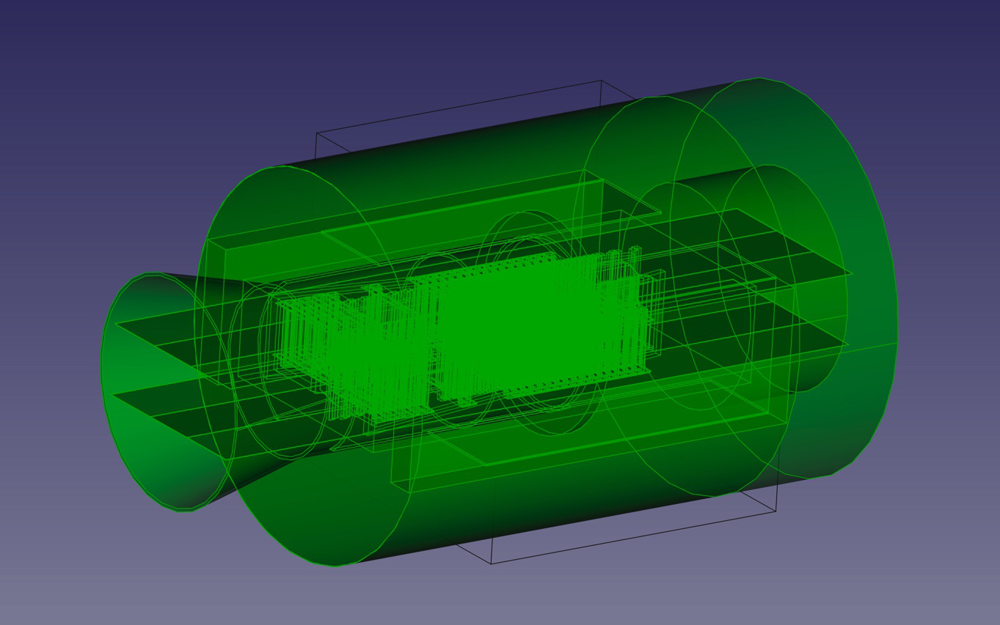
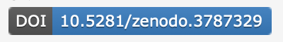

## FreeCAD GDML Workbench

### Introduction 

**[FreeCAD](https://freecad.org)** is a Free Libre Open Source multi-platform CAD/CAM/FEM suite.
**GDML** stands for **Geometry Description Markup Language** and is an application-indepedent geometry description format based on XML. It can be used as the primary geometry implementation language as well providing a geometry data exchange format for existing applications. 

The main use of GDML is with Nuclear Physics MonteCarlo Simulation programs GEANT4 and ROOT

The **FreeCAD GDML Workbench** can be used for:
* Viewing
* Creation
* Modification

of GDML models.

## Screenshots

Viewing CERN's LHCBVelo.gdml using the experimental FreeCAD LinkStage3 Daily branch:

  

## Important Noticies

### New Gmsh facility - (12/22) [Gmsh Min Tessellate](https://github.com/KeithSloan/GDML/wiki/Gmsh---Min-Tessellate)

Uses a recent facility in Gmsh to Tessellate and then **recombine** facets, reducing the
complexity of the mesh. Trivial example is that a cube will be 6 Quad Facets, rather than 12 Triangular Facets.

### New branch **loops**

Munther has created a new branch which adds support for importing GDML files with loops.
We would welcome feedback on any success or issues.

### FreeCAD 0.20

Now FreeCAD 0.20 has been released. 

The Default branch is now **Main** rather than **master**.
Users should delete the GDML workbench and reinstall via the Addon manager

The Addon manager with FreeCAD 0.20 has the facility to select and change branches,
so if you want to go back you can use this facility to select **master**

### Use with Realthunders LinkDaily branch

* You should also see a dramatic improvement especially with LinkDaily in import times with these builds.

#### Enhanced Rendering (on Realthunder's LinkDaily branch)
There is also the option to use enhanced rendering which helps with complex models. To enable enhanced rendering in LinkDaily:

`FreeCAD > Preferences > Display > Render Cache > Experimental`
   
If you like what you see you might like to thank Lei Zhang by contributing to his [FreeCAD Patreon](https://www.patreon.com/thundereal/posts)


** Changes to Placement (GDML Position & Rotation) **

Export of GDML objects the Position and Rotation are now a combination of the Placement of the FreeCAD App::Part (GDML Volume)
and the Placement of the GDMLObject

** New experimental export for GEMC**

## Installation 

### Prerequisites

* FreeCAD (https://freecad.org/)
* `lxml` (bundled in to FreeCAD v0.19)
* `gmsh` python library

### gmsh python library

The workbench uses the gmsh python library and must be installed in a location that FreeCAD sees

To check path FreeCAD uses from a command line/window.

    freecad -c
    import sys
    print(sys.path)

In a command window / line

    pip install --upgrade --target <Full path to directory> gmsh

Windows: if no --target option upgrade pip

### Successful installation of workbench & gmsh on Windows.

User @poroserv reports successful installation as follows

"today I installed the new GDML Workbench 2.0.0 without any problem."

Below I have compiled a sequence of magic spells to get a working version FreeCAD/GDML/GMSH for Windows:

Install "only for me" to "D:\FreeCAD 0.20" to prevent any file/folder access problems.

Upgrade/Install additional python modules:

````
D:\FreeCAD 0.20\bin\python -m pip install --upgrade pip
D:\FreeCAD 0.20\bin\python -m pip install --target="D:\FreeCAD 0.20\bin\Lib\site-packages" --upgrade lxml
D:\FreeCAD 0.20\bin\python -m pip install --target="D:\FreeCAD 0.20\bin\Lib\site-packages" --upgrade gmsh
D:\FreeCAD 0.20\bin\python -m pip install -i https://gmsh.info/python-packages --force-reinstall --no-cache-dir --upgrade --target="D:\FreeCAD 0.20\bin\Lib\site-packages" gmsh-dev
````
Download the Software Development Kit (SDK) for Windows of GMSH from https://gmsh.info/bin/Windows/gmsh-4.10.5-Windows64-sdk.zip , unpack it and copy:
````
..\bin to "D:\FreeCAD 0.20\bin\Lib\site-packages\bin"

..\include to "D:\FreeCAD 0.20\bin\Lib\site-packages\include"

..\lib to "D:\FreeCAD 0.20\bin\Lib\site-packages"
````
to add the missed "gmsh.exe", "gmsh-4.10.dll" and update "gmsh.py".

install GDML workbench.


### Install via the Addon Manager

The GDML workbench can be installed via the [Addon Manager](https://wiki.freecad.org/Std_AddonMgr) 

1. Start FreeCAD
2. Click the `Tools` → `Addon manager` dropdown menu
3. Browse through the list of workbench and look for GDML

### Prerequisite 3rd party Python libraries 

<details>
<summary>Click to expand!</summary>

Currently there are two 3rd party libraries that are necessary for the GDML workbench to function: `lxml` and `gmsh`.

#### `lxml`

[lxml](https://lxml.de/) is a Python library that processes XML and HTML. Starting with the below versions of FreeCAD, `lxml` should be auto-bundled as part of the installation:

   * `FreeCAD_0.19.19424` and above
   * `FreeCAD_0.19.19409_x64_Conda_Py3QT5-WinVS2015.7z` and above.
   

##### Checking if `lxml` is installed

To discover if **`lxml`** is installed and accessible by FreeCAD:

1. Open the CLI
2. Invoke the following:
    ```python
    freecad -c
    import sys
    print(sys.path)
    ```
    Result:


**Note:** To check if **`lxml`** is installed correctly:

  ```python
  freecad -c
  import lxml
  from lxml import etree
  print(etree.LXML_VERSION)
  ```

##### Manual install of lxml

In case there is a need to manually install `lxml`: 

  ```bash
  pip3 install lxml -t < directory >
  ```


### `Gmsh`

[Gmsh](https://gmsh.info/) is an open source 3D finite element mesh generator. FreeCAD & Gmsh should both be using the same version of OCC (OpenCasCade), the underlying CAD kernel that FreeCAD uses.

|   OCC   |   FreeCAD   |     gmsh      |
|---------|-------------|---------------|
|   `7.4` |   `0.19.1`  |`4.7.0 - 4.7.1`|
|   `7.6` |             |`4.8.0 - 4.8.4`|

At the time of writing a prebuilt version of FreeCAD with OCC 7.6 is not available

Note: The version of OCC with FreeCAD 0.19.2 has a regression with STEP functionality

You can check the version FreeCAD is using with About FreeCAD, copy to clipboard, paste.

#### Checking what version of Gmsh is installed

To ascertain the Gmsh version, paste the following in to the python console

  ```python
  import gmsh
  gmsh.initialize()
  print(gmsh.option.getString("General.BuildInfo"))
  gmsh.finalize()
  ```

#### Check the Gmsh version using `gmshVer.py`
It is also possible to run the `gmshVer.py` script (available in this workbench's `Utils` directory). To see what versions of Gmsh are available to install, open the CLI and type:

  ```bash
  pip install gmsh==
  ```
  **Note:** Gmsh must be installed in a location that FreeCAD can access. To check the path FreeCAD uses, open the CLI and type:

  ```bash
  freecad -c
  import sys
  print(sys.path)
  ```
In a command window / line

    pip install --upgrade --target <Full path to directory> gmsh=='version'
  
Windows: if no --target option upgrade pip   

    python -m pip install -U pip
        
For example on Windows system where FreeCAD is installed on the D drive

    pip install --target="D:\FreeCAD 0.19\FreeCAD_0.19\bin\Lib\site-packages" gmsh
    
will create 

    D:\FreeCAD 0.19\FreeCAD_0.19\bin\Lib\site-packages\gmsh-4.6.0-py3.8.egg-info
    D:\FreeCAD 0.19\FreeCAD_0.19\bin\Lib\site-packages\Lib\site-packages\gmsh-4.6.0-Windows64-sdk

</details>

## Usage 

* To read more about the general usage of the GDML workbench checkout the [GDML Workbench wiki](https://github.com/KeithSloan/GDML/wiki)
* Converting STEP files to GDML [Convert Step to GDML](https://github.com/KeithSloan/GDML/wiki/Step2Tessellate)
* Creating Tessellated Objects from FreeCAD Part Design Objects [Tessellate Part Design](https://github.com/KeithSloan/GDML/wiki/Tessellating-Part-Design-Objects)
* Creating a GDML object from Sketches, these can be created by
  * [Extruding a sketch](https://github.com/KeithSloan/GDML/wiki#extruded-sketches)
  * [Revolving a sketch](https://github.com/KeithSloan/GDML/wiki#revolved-sketches)
* Support for GDML Objects as subject of 
  * [Arrays](https://github.com/KeithSloan/GDML/wiki#arrays-of-objects)
  * [Mirrors](https://github.com/KeithSloan/GDML/wiki#mirrored-objects)
  * [Scaled](https://github.com/KeithSloan/GDML/wiki#scaled-objects)
* Details of support for GDML [Optical properties](https://github.com/KeithSloan/GDML/wiki/Optical-Support)  


<details>
<summary>FOLLOWING TO BE MOVED TO WIKI</summary>

### Create a new GDML design

1. Start FreeCAD
2. Select the **GDML workbench** from the workbench dropdown menu.
3. Select **File > New**  
   Result: This will load the default GDML File with materials and creates a World Volume.  
4. Create `1-n Volumes` in the World Volume by
   * Click on the Part icon (image: yellow blockish icon)
   * Drag the created **Part** to the World Volume in the **Tree** window
   * **Part** maybe renamed via right click context menu  
5. Create GDML Solids by:  
   * Clicking on the corresponding icon of the workbench, this will create a Part(GDML Volume) which contains the GDMLsolid
   * You can then change the attributes by selecting the GDMLObject in the **Tree** window and changing the properties in the **Property View**
   * You can alter the position and rotation by changing the Placement parameters in the Part(GDML Volume)
   * You can select and drag the Part(GDML Volume) to the appropriate part of the overall model structure
      
  So a valid structure for a GDML file is:  
   * Single World Volume (Part)
   * A number of Volumes (Parts) under the World Volume
 
6. To Export to GDML
    1. Select the 'World' Volume ( Default Name WorldVol )
    2. File export
    3. Select filetype as GDML ( Bottom Box of **Export file** window)
    4. Select Destination and file name with **GDML** as file extension 

**Important Notes:**  
* Opening a new file when the GDML workbench is active will load a Default file.
* The Default file is defined in `GDML/Mod/Resources/Default.gdml`.
* If a material is selected in 'Labels & Attributes window at the time a new GDML objects is created
  then this will set the material of the new Object. If no material is selected the objects material is set to the
  first material in the Defaults file i.e. `SSteel0x56070ee87d10`
  
## GDML Object Creation

Upon switching to the GDML workbench, one will notice a number of icons that become available on the Workbench bar.

* Clicking on one of the icons will create a Part(GDMLvolume) containing the GDML object

  If at the time a material is selected e.g. in the 'Labels & Attributes' window,
  then the object will be created with that material, otherwise the material will be set to the first material in the list.
  
* You can then alter the Objects properties via the properties window. The parameters should be the same as in the [GDML user guide]().
* Note: If you toggle values via your mouse, you then need to hit enter for the changes to show in the main view.
* If the Object is part of a Boolean you will have to use the **recompute** facility of FreeCAD to see the change to the Boolean. This can be achieved through the right clicking on the context menu or clicking the **Recompute** icon in the toolbar.
* If a Part(GDML Volume) is selected at the time of clicking on the icon, then the new Part(GDML volume ) and GDML object will be created as
a subvolume of the one selected, otherwise the created Part can then be dragged to the appropriate part of model structure

## GDML Tessellated Objects

The following icons are available for Tessellated operations

### Tessellate
 Tessellate

If the selected FreeCAD object has a Shape then a GDML Tessellated Object is created by using the Meshing
Workbench default options. If a material is also selected this will determine the GDML material of the
created GDML Tessellated Object

### Tessellate with Gmsh


If the selected FreeCAD object has a Shape or Mesh then a Gmsh Panel is displayed in the Task Window.

The panel displays
 
   1) Bounding box information for the selected Object
   2) Type of Mesh
   3) Input parameters for the Gmsh operation
   4) Action 'Mesh' button
   
Clicking on the 'Mesh' button a GDML_Tessellate_Gmsh Object is created and Mesh info is added to the panel.
The input parameters can be changed and another Gmsh operation performed.

Once happy with the Mesh, then Object being meshed can be deleted before exporting to the GDML format.
The panel needs to be closed before working on another object

### FC Mesh to GDML Tessellated
 Mesh to GDML Tessellated

If the selected FreeCAD object is a mesh then a GDML Tessellated Object is created. Again if a material is
also selected then this will set the GDML material of the GDML Tessellated Object.

   1) FreeCAD Supports a large number of mesh file formats including stl, ply, etc
      so **Mesh 2 Tessellate** allows these to be converted to a GDML Tessellate object
      
   2) The Mesh Workbench offers a range of meshing facilities with options ( Meshes | create mesh from Shape )
   
      * Standard
      * Mefisto
      * Netgen
      * Gmsh ( Requires FreeCAD 0.19+ )
      * Gmsh also offers a **Remesh** facility ( Meshes | Refinement )
      
      So having created a mesh using the Mesh workbench, one can then switch to the GDML Workbench to
      create GDML Tessellated objects from these.
      
### GDML Tessellated to FC Mesh
 GDML Tessellated to FC Mesh

If the selected FreeCAD object is a GDML Tessellated Object a FreeCAD Mesh is created.      

### GDML Tetrahedron (GDML Assembly of GDML Tetra)
 GDML Tetrahedron

If the selected FreeCAD object has a Shape or is a Mesh then a Tetrahedera Object is created by using gmsh.
This can then be exported as a GDML Assembly of GDML Tetra

If you would like to see support of remeshing of Tetrahedra the same as Tessellated then please contact me or raise as an issue.

## GDML Import

A lot more GDML solids are supported for import. For example all Solids
used by the CERN Alice.gdml are defined.

On import or open of a GDML file a Dialog box will open with two options

- Import
- Scan Vol

Import will do a straight import of GDML Objects.

Scan Vol is for large files like Alice.GDML that take far too long to process. 

Volumes are only processed to a limit depth i.e. volume names are determined but not processed
For unprocessed volume the names are preceded by **`NOT_Expanded`** so an example volume name would be: `NOT_Expanded_<VolumeName>`

#### Expansion of Scanned Volume

Unexpanded Volumes can be expanded by:  
1. Switching to the GDML workbench.
2. Selecting a volume in the **_labels & attributes_** window
3. Clicking on one of the the experimental Expand Volume Icons 
   - 
   - Expand Selected Volume to Minimum Level
     
   - 
   - Expand Selected Volume to Full Depth
   
On opening of a GDML file the appropriate FreeCAD implemented python Object is created for each solid

## Viewing Volumes

The first icon on the workbench bar is different. If you select a object by one of the following methods  

1. A volume via the Combo view - Model - Labels & Attributes.

   Then click on the icon it will cycle the display mode of the selected Volume and all its children.
   The cycle is Solid -> WireFrame -> Not Displayed -> Solid

2. In the main display - select a face by <ctrl> <left mouse>
   
   Then click on the icon it will cycle the display mode of the selected object
   
## SampleFiles

[SampleFiles](SampleFiles/) directory contains some sample gdml files. 

One in particular is lhcbvelo.gdml. This file takes a LONG LONG time to import/open, over a minute on my system, but does eventually load. On my system I have to okay one wait. When it finally does display you will want to zoom in.

If when it is displayed you go down the Volumes tree to VelovVelo under the World volume then click on the toggle icon ( 1st GDML icon in the workbench) Again wait patiently and the display will change to wireframe. You can
then descend further down the Volumes tree, select one and again use the toggle icon and that volume and children will change to Solid. In this way various parts in different volumes can be examined.

## GDML Objects Exporter 

To export to GDML 

1. Select the 'world' Volume, should be first Part in Design
2. File export
3. Select GDML as filetype
4. Make sure file has GDML as file extension

### GDML Objects

GDMLObjects are output as straight GDML solids

### FreeCAD Objects

The following FreeCAD objects are output as GDML equivalents

| FreeCAD   |   GDML     |
| :-----:   |  :----:    |
| Cube      |  Box       |
| Cone      |  Cone      |
| Cylinder  |  Tube      |
| Sphere    |  Sphere    |

If not handled as above then objects shapes are checked  to see if planar,
if yes converts to Tessellated Solid with 3 or 4 vertex as appropriate.
If not creates a mesh and then a Tessellated solid with 3 vertex.

### Export of STEP version

Standard FreeCAD export facilities are available which includes the ability to create a STEP version

### Export/Import of Materials as an XML file.

If you select the Materials Group in Tree view and then use the standard FreeCAD export,
the export will create an xml file of the material definitions. You can then import this
file and the material definitions into a separate FreeCAD document. Note: The file extension
used should be xml NOT gdml

The Materials directory contains a number of Materials XML files including NIST Database
that can be imported.

## GEMC

This is still at an early stage of development and has some rough edges, extra support will be added over time

### Import of STEP file for GEMC

The FreeCAD default settings for Import of a STEP file is to create a single Compound,
so the FreeCAD Import/Export Preferences for STEP Import should be set as follows


1) Make sure Import/Export Preferences are set. (Avoid Compound and LinkGroup)
2) Open the STEP File

#### To access FreeCAD STEP Preferences

 1) Select **FreeCAD-version-number** from the Tool bar
 2) Then **Preference**
 3) In left hand column select Import/Export
 
 
 
 4) Then from top TAB = STEP
 5) This displays the Export options followed by the Import Options

### Export for GEMC

1) Switch to the GDML workbench if not the current workbench
2) Click on colourMap Icon  ColourMap
3) Allocate Materials to Colours
4) Select Export on the Toolbar
5) Enter directory path ( No file extension )
6) Select the Export type ( Note: Filetype is Not used )

   * Selecting GEMC lower case option GEMC - stp (*.gemc) 
       
     This creates a directory structure for a CAD Factory - Where all FreeCAD Objects with Shapes are exported as stl files

   * Selecting GEMC upper case option GEMC - gdml (*.GEMC)
     
     Then GDML objects and FreeCAD Object that directly convert are output in a GDML file of a GDML Factory,
     Other Objects with a Shape are output as STL files in a CAD Factory.
       
### Constants / Isotopes / Elements / Materials

Importing a GDML will create FreeCAD objects for the above and export should
create the same GDML definitions as imported.

The Ability to change to change these maybe implemented in the future.
 
## Preferences

There is now an option to toggle `Printverbose` flag to reduce printing to the python console.

## Compound & FEM - Finite Element Analysis

### Use of `compound` icon        GDML Compound
to facilitate preparation for FEM analysis

#### Usage

* **Select** a volume/Part i.e. the first Part which is the GDML world volume and **click on** the `compound` icon **'C'**
  1. Creates an object named **Compound** under the selected Volume
  2. Create an FEM Analysis Object.
  3. All the materials of the objects in the Volume/Part/Compound are added to the Analysis Object.
  
* You can then switch to the **FEM Workbench** (_Finite Element Analysis_) and proceed with an analysis which would include:
  
  1. Double click on each of the materials to edit their properties
  2. From the FEM workbench select the Compound Object and click on the icon to create a Mesh.
  3. Rest would depend on what analysis and what solver it is intended to use.
  
  Also as an experiment: thermal parameters have been added to the `GDMLmaterial` object so these could
  be changed before creating a compound. One option to be would be to add elements to GDML files to enable
  loading and exporting, but then they would **NOT** be standard GDML files (maybe a different file extension?)  

</details>

## Standalone Utilities

The standalone utilities and documentation are now in a submodule repository https://github.com/KeithSloan/GDML_Command_Line_Utils  

  In the [Utils](Utils/) directory, you'll find a python script named **`gdml2step.py`** for creating a STEP file from a GDML file.

The syntax is as follows:

  ```bash
  python3 gdml2step.py <input gdml file> <oustep file>
  ```

**Note:** the step file should be given a `.step` extension.

In theory other file extension should produfile of the appropriate type, e.g. iges, but this is untested.

## Citing information

[](https://doi.org/10.5281/zenodo.3787318)

If you found this Workbench useful in your research we would appreciate being cited
as per the above link.


## Roadmap

  - [ ] Change structure of xml handling to use Python class rather than global variables
  - [ ] Check handling of different Positioning between GDML & FreeCAD
  - [ ] Add support for quantity
  - [ ] Add further GDML Objects
  - [ ] Add facility to edit Materials
  - [ ] Add facility to edit Isotopes
  - [ ] Add facility to edit Elements 
  - [ ] Documentation
  - [ ] Investigate handling of Materials
  - [ ] Need to sort out AIR definition

**Workbench**

  - [ ] Workbench Dialog for initial GDML Object values(?)
  - [ ] Analyze FreeCAD file for direct conversion of object to GDML solid
  - [ ] Display mesh for objects that will not directly convert
  - [ ] Provide options to control meshing objects that will be Tessellated
  - [ ] Icons to Analyze and Export

## Development Notes
 
Based on `gdml.xsd`

* 'Volumes'
  * **Must** have **solid & material ref**
* PhysVol
  * Must contain **volref** (or file)
  * volref **must not** be same as current volume name
  * May contain **position** or **position ref**
  * May contain **rotation** or **rotation ref**

## Acknowledgements 

**Developers**

  * Keith Sloan
  * Munther Hindi
  * Damian Lambert

**Graphic Icons** 

* GDML Shapes designed by Jim Austin (jmaustpc)  
* Cycle icon by Flaticon see www.flaticon.com
   
**Very large thank you to Munther Hindi for extensive problem solving**  
  
**For Help with documentation**
  
  * Luzpaz

**Thank you also to:** 

  * Louis Helary
  * Emmanuel Delage
  * Ami Hashemi
  * Wouter Deconnick
  * Hilden Timo
  * Atanu Quant
  * Masaki Morita

  
* FreeCAD forum members (Apologies if I left anybody out):

  * wmayer
  * Joel_graff
  * chrisb
  * DeepSOIC
  * ickby
  * edwilliams16
  * looooo
  * easyw-fc
  * bernd
  * vocx
  * sgrogan
  * onekk (Carlo D)
  * OpenBrain
  * Roy_043
  * TheMarkster
  * jeno

* OpenCascade Forum members:
  * Sergey Slyadnev
  
* Stack Overflow
  * Daniel Haley
    
## Notes

* For NIST Materials database see http://physics.nist.gov/PhysRefData
* Need to sort out AIR definition

## Feedback

Please report bugs by opening a ticket in the [issue queue](https://github.com/KeithSloan/FreeCAD_Python_GDML/issues)

**Note: I am always on the look out for test gdml files (small to medium size)**

## Author

To contact the author via email: keith[at]sloan-home[dot]co[dot]uk 
