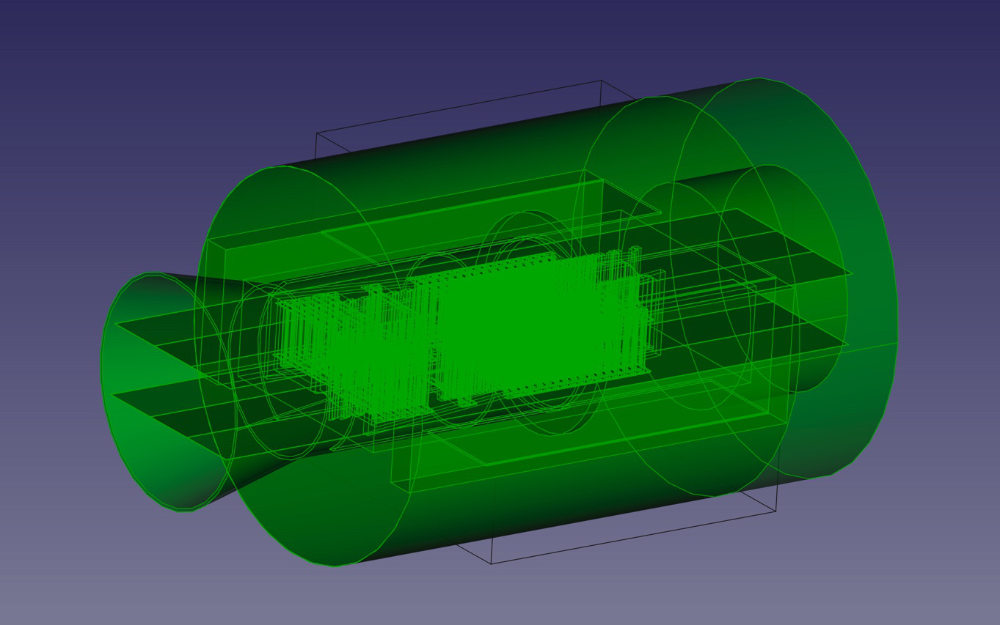
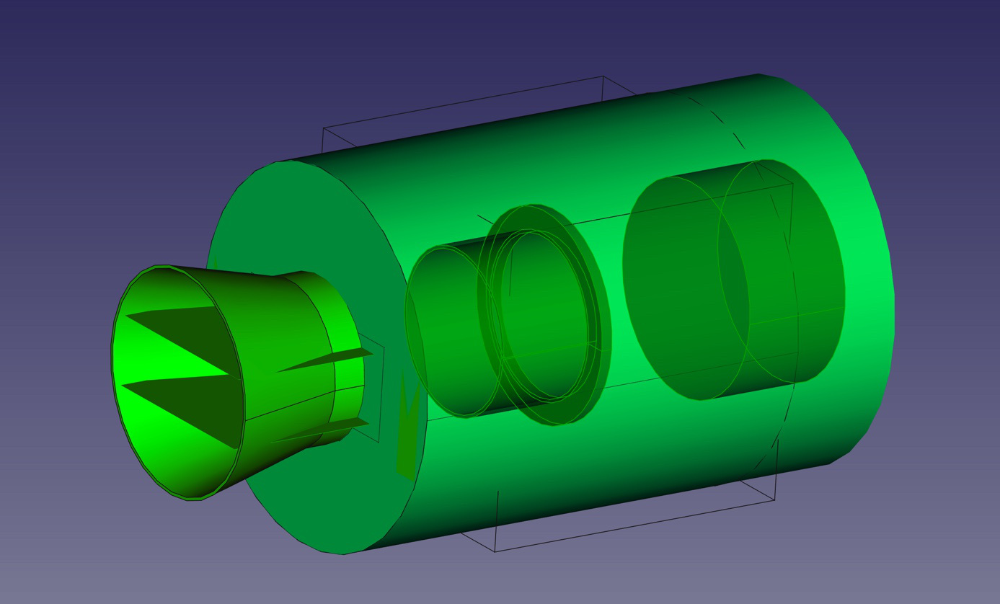
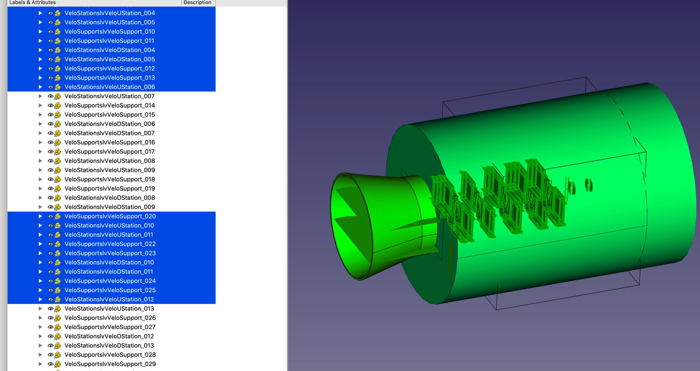
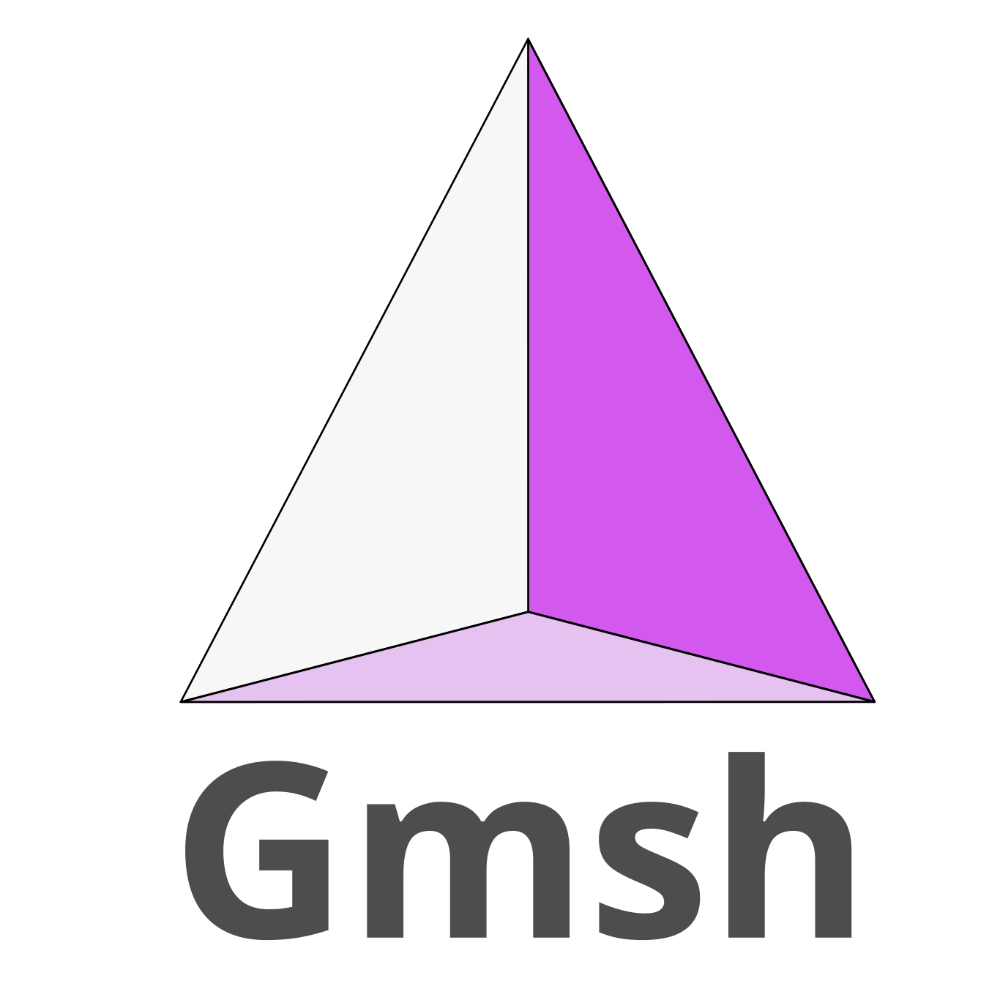

# FreeCAD GDML Workbench

[](https://doi.org/10.5281/zenodo.3787318)

A [FreeCAD](https://freecad.org) workbench for viewing, creating, and editing geometry described in **GDML** — the standard geometry format used by GEANT4, ROOT, and OpenMC Monte Carlo simulation frameworks.

---

## Who is this for?

This workbench bridges two communities that need to work together:

**Physicists and simulation engineers** who build detector or experiment geometries in GEANT4/ROOT using GDML can open those geometries in FreeCAD to visualise, inspect, and modify them — without needing deep CAD expertise.

**Mechanical engineers and CAD designers** who work in FreeCAD can design components and assemblies and export them directly to GDML, making the geometry immediately usable in GEANT4, ROOT, or OpenMC simulations — without needing to know the simulation frameworks.

The workbench also supports the reverse path described by L. Helary et al.: starting from a GEANT4 geometry, generating a STEP file for use in mechanical CAD workflows.

---

## What is GDML?

**GDML** (Geometry Description Markup Language) is an XML-based, application-independent format for describing 3D geometry. It is the primary geometry language for:

- **[GEANT4](https://geant4.org)** — the widely used particle physics Monte Carlo simulation toolkit
- **[ROOT](https://root.cern)** — CERN's data analysis and simulation framework
- **[OpenMC](https://openmc.org)** — an open-source Monte Carlo particle transport code popular in nuclear engineering

---

## Screenshots

Viewing CERN's LHCb Velo detector geometry:

  

---

## Capabilities

- **Import** GDML files from GEANT4, ROOT, or OpenMC — including large, complex detector geometries
- **View and navigate** volume hierarchies with display mode cycling (solid / wireframe / hidden)
- **Create** GDML geometry from scratch using native GDML solid types within FreeCAD
- **Edit** solid parameters, materials, placements, and rotations interactively
- **Export** to GDML for use in Monte Carlo simulations
- **Tessellate** complex CAD shapes for GDML using FreeCAD's built-in mesher or [Gmsh](https://gmsh.info)
- **Convert** between GDML and STEP/STL/OBJ for exchange with mechanical CAD tools
- **FEM preparation** — create compound objects and material assignments for finite element analysis

---

## Installation

### Recommended: FreeCAD Addon Manager

The easiest way to install the workbench:

1. Open FreeCAD
2. Go to **Tools → Addon Manager**
3. Search for **GDML** and click **Install**

### Prerequisites

| Library | Status | Notes |
|---------|--------|-------|
| `lxml`  | Bundled in FreeCAD 0.19+ | No action needed for modern FreeCAD |
| `gmsh`  | Must be installed manually | See below |

### Installing gmsh

Gmsh must be installed for **the same Python interpreter that FreeCAD uses**. If there is a version mismatch, the workbench will display an error message showing exactly which Python version FreeCAD is running and the correct install command to use.

To find which Python FreeCAD uses, open a terminal and run:

```bash
freecad -c
import sys
print(sys.version)
print(sys.executable)
```

Then install gmsh targeting that Python:

```bash
# Using FreeCAD's Python directly (replace path as shown above):
/path/to/freecad-python -m pip install gmsh

# Or using pip with an explicit target directory:
pip install --upgrade --target /path/to/freecad/site-packages gmsh
```

#### macOS (FreeCAD 1.0.0 / Python 3.11)

```bash
/Applications/FreeCAD\ 1.0.0.app/Contents/Resources/bin/python3.11 -m pip install gmsh
```

#### Windows (FreeCAD installed on D:\\)

```bat
D:\FreeCAD\bin\python -m pip install --upgrade pip
D:\FreeCAD\bin\python -m pip install --target="D:\FreeCAD\bin\Lib\site-packages" gmsh
```

#### Verifying gmsh is correctly installed

Paste the following into FreeCAD's Python console:

```python
import gmsh
gmsh.initialize()
print(gmsh.option.getString("General.BuildInfo"))
gmsh.finalize()
```

---

## Quick Start

### Opening a GDML file (physicist's workflow)

1. Select the **GDML workbench** from the workbench dropdown
2. **File → Open** and select your `.gdml` file
3. A dialog will appear with two options:
   - **Import** — load the full geometry (suitable for small to medium files)
   - **Scan Vol** — load volume names only, expanding individual volumes on demand (recommended for large files like `alice.gdml`)
4. Use the **tree view** to navigate the volume hierarchy
5. Click the **cycle display icon** (first icon on the GDML toolbar) to toggle a selected volume between solid, wireframe, and hidden

> **Large files:** For complex detectors, use Scan Vol mode. Volumes not yet expanded are prefixed with `NOT_Expanded_`. Select one and click an Expand icon to process it.

### Creating geometry for simulation (engineer's workflow)

1. Select the **GDML workbench** and choose **File → New**
   — this loads a default GDML document with materials and a World Volume
2. Click a **GDML solid icon** on the toolbar to create a solid (Box, Tube, Sphere, etc.)
   — the solid is created inside a Part (GDML Volume) automatically
3. Select the object in the tree and edit its **properties** (dimensions, material, placement)
4. Drag volumes into the correct position in the tree hierarchy
5. When ready, select the **World Volume** and use **File → Export**, choosing GDML as the file type

---

## Usage

Full documentation is available on the [GDML Workbench Wiki](https://github.com/KeithSloan/GDML/wiki), including:

- [Converting STEP files to GDML](https://github.com/KeithSloan/GDML/wiki/Step2Tessellate)
- [Tessellating Part Design objects](https://github.com/KeithSloan/GDML/wiki/Tessellating-Part-Design-Objects)
- [Extruded sketches](https://github.com/KeithSloan/GDML/wiki#extruded-sketches)
- [Revolved sketches](https://github.com/KeithSloan/GDML/wiki#revolved-sketches)
- [Arrays of objects](https://github.com/KeithSloan/GDML/wiki#arrays-of-objects)
- [Mirrored objects](https://github.com/KeithSloan/GDML/wiki#mirrored-objects)
- [Scaled objects](https://github.com/KeithSloan/GDML/wiki#scaled-objects)
- [Optical properties](https://github.com/KeithSloan/GDML/wiki/Optical-Support)
- [Import of OBJ files](https://github.com/KeithSloan/GDML/wiki/Import-of-OBJ-file)
- [Gmsh Min Tessellate](https://github.com/KeithSloan/GDML/wiki/Gmsh---Min-Tessellate)

---

## Tessellation

When a FreeCAD shape cannot be represented exactly as a GDML primitive solid, it is tessellated — broken into triangular or quadrilateral facets — and exported as a GDML `<tessellated>` solid.

### Tessellate (FreeCAD mesher)


Creates a GDML tessellated solid from any FreeCAD shape using FreeCAD's built-in mesher.

### Tessellate with Gmsh


Opens a Gmsh panel with controls for mesh type (Triangular, Quadrangular, Parallelogram) and characteristic lengths. Allows iterative re-meshing before committing.

### Gmsh Min Tessellate
Uses Gmsh's recombination algorithm to reduce mesh complexity. A cube, for example, becomes 6 quad facets rather than 12 triangles, keeping GDML files compact.

### Mesh ↔ Tessellated conversion
- **FC Mesh → GDML Tessellated**  — converts any FreeCAD mesh (STL, PLY, etc.) to a GDML tessellated solid
- **GDML Tessellated → FC Mesh**  — converts back for use with FreeCAD's mesh tools

### GDML Tetrahedron


Creates a tetrahedral mesh of a shape using Gmsh and exports it as a GDML Assembly of GDML Tetra elements.

---

## Import / Export

### Supported GDML → FreeCAD solid types

All standard GDML primitives are supported on import, including all solids used in the CERN Alice and LHCb detector geometries.

### FreeCAD → GDML automatic mapping

| FreeCAD object | GDML solid |
|----------------|-----------|
| Cube | Box |
| Cone | Cone |
| Cylinder | Tube |
| Sphere | Sphere |

Objects that do not map to a GDML primitive are automatically tessellated on export. Planar objects produce 3- or 4-vertex facets; curved objects are meshed to triangular facets.

### Exporting to GDML

1. Select the **World Volume** in the tree (default name: `WorldVol`)
2. **File → Export**
3. Set file type to **GDML**
4. Give the file a `.gdml` extension

### Materials export/import

Select the **Materials Group** in the tree view and use File → Export to save material definitions as an XML file (use `.xml` extension, not `.gdml`). This file can be imported into another FreeCAD document to transfer material definitions.

The `Materials/` directory includes pre-built material XML files including the full NIST materials database.

---

## FEM (Finite Element Analysis)

Use the **Compound icon**  to prepare a GDML geometry for FEM analysis:

1. Select the World Volume and click the Compound icon — this creates a Compound object and an FEM Analysis object, with all GDML materials added automatically
2. Switch to the **FEM Workbench** to proceed with meshing and analysis

GDML material objects carry thermal parameters that can be edited before creating the compound, enabling thermal FEM analysis on simulation geometries.

---

## Standalone Utilities

Command-line utilities for working with GDML files outside FreeCAD are maintained in a separate repository: [GDML_Command_Line_Utils](https://github.com/KeithSloan/GDML_Command_Line_Utils).

The `Utils/` directory also contains `gdml2step.py` for converting a GDML file to STEP format:

```bash
python3 gdml2step.py <input.gdml> <output.step>
```

---

## Sample Files

The `SampleFiles/` directory contains example GDML files. Notable examples:

- **`lhcbvelo.gdml`** — the LHCb Velo detector. This is a large, complex file that takes over a minute to import. Use the volume toggle icon (first GDML icon) to selectively display volumes as solid or wireframe.

---

## Citing

If this workbench contributed to published research, please cite it:

[](https://doi.org/10.5281/zenodo.3787318)

**Selected publications using this workbench:**

- Helary et al. — GEANT4 → STEP → CAD workflow: http://doi.org/10.1140/epjs/s11734-021-00249-z

- Le, Hashemi, Ottensmeyer, Sabet — *Flexible and Generic Framework for Complex Nuclear Medicine Scanners using FreeCAD/GDML Workbench*
  [arXiv:2411.12751](https://arxiv.org/abs/2411.12751) | [CAD Journal Vol. 23 No. 1](https://www.cad-journal.net/files/vol_23/Vol23No1.html)

- VPG4 — *Versatile Parallelizable Geant4 Interface*
  [ResearchGate](https://www.researchgate.net/publication/372909610_VPG4_Versatile_Parallelizable_Geant4_Interface_A_Novel_Platform_for_Modeling_Complex_Nuclear_Medicine_Imaging_Scanners)

- Munther Hindi — presentation at the 15th GEANT4 Space Users Workshop, NASA Pasadena:
  [Video](https://www.youtube.com/watch?v=VrcFnbr1HLQ) | [PDF](https://github.com/KeithSloan/GDML/blob/Main/Presentation/GDML_Workbench_Pasadena_without_animation.pdf)

---

## Roadmap

**Core:**
- [ ] Support for OpenMC geometry format (PR open)
- [ ] Change XML handling to use Python classes rather than global variables
- [ ] Add support for GDML `quantity` elements
- [ ] Add facility to edit Materials, Isotopes, and Elements interactively
- [ ] Add further GDML solid types

**Workbench:**
- [ ] Dialog for setting initial GDML object parameter values
- [ ] Analyse FreeCAD file to identify objects that convert directly vs. require tessellation
- [ ] Provide mesh preview for objects that will be tessellated on export
- [ ] Controls to tune tessellation quality per object before export

---

## Acknowledgements

**Core developers:** Keith Sloan · Munther Hindi · Damian Lambert

**Graphic icons:** GDML shapes by Jim Austin (jmaustpc) · Cycle icon by Flaticon (www.flaticon.com)

**Special thanks:** Munther Hindi for extensive problem solving · Luzpaz for documentation help

**Contributors:** Louis Helary · Emmanuel Delage · Ami Hashemi · Wouter Deconnink · Hilden Timo · Atanu Quant · Masaki Morita

**FreeCAD forum:** wmayer · Joel_graff · chrisb · DeepSOIC · ickby · edwilliams16 · looooo · easyw-fc · bernd · vocx · sgrogan · onekk (Carlo D) · OpenBrain · Roy_043 · TheMarkster · jeno

**OpenCASCADE forum:** Sergey Slyadnev · **Stack Overflow:** Daniel Haley

---

## Feedback and Contributing

- **Bug reports:** [Open an issue](https://github.com/KeithSloan/GDML/issues)
- **Test files:** Small to medium GDML files for testing are always welcome
- **Contact:** keith[at]sloan-home[dot]co[dot]uk

---

## Development Notes

Based on `gdml.xsd`. Key structural constraints:

- Volumes **must** have a solid ref and a material ref
- PhysVol **must** contain a volref (or file); the volref must not be the same as the current volume name; may contain position/rotation or refs to defined position/rotation

NIST materials database: https://www.nist.gov/pml/productsservices/physical-reference-data
